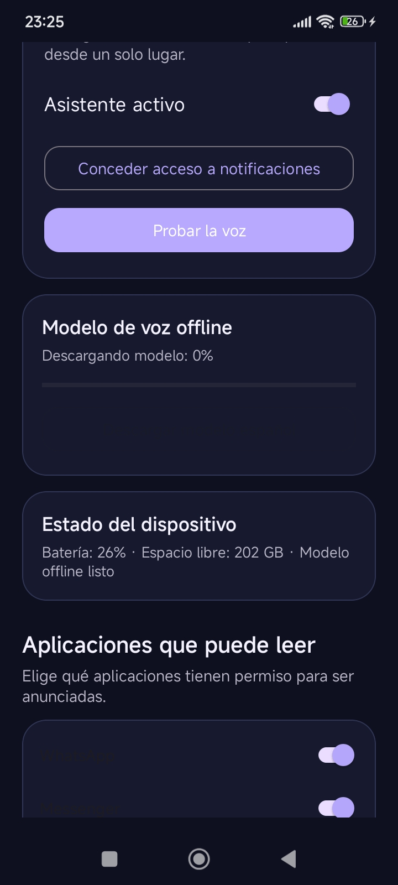
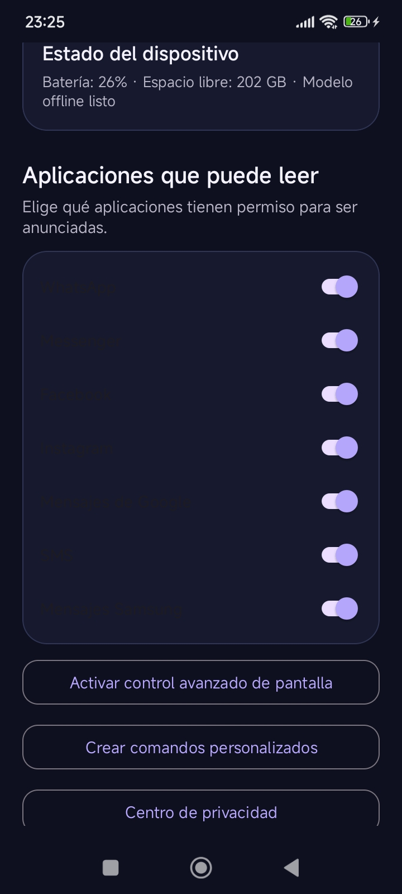

# VozLuma Premium

**VozLuma Premium 3.2.0** es un asistente de voz para Android diseñado para funcionar localmente. Escucha la palabra **«Hola»**, responde **«Hola, ¿en qué puedo ayudarte?»** y ejecuta comandos útiles del teléfono mediante reconocimiento de voz offline, texto a voz y servicios nativos de Android.

> **Descarga directa:** [descargar VozLuma-Suite-3.2.apk](https://github.com/HUEVOMAN77/vozluma/releases/download/v3.2.0/VozLuma-Suite-3.2.apk)
>
> **Privacidad primero:** el modelo de reconocimiento, el audio de activación, el historial, los borradores y las preferencias se procesan y almacenan localmente. La aplicación no requiere cuentas ni servidores propios.

## Capturas de la interfaz





## Funciones principales

| Área | Capacidades destacadas |
|---|---|
| Activación offline | Detección local de «Hola» con Vosk, respuesta inicial hablada y ventana de conversación de 20 segundos. El modelo español viene integrado en la APK y se instala localmente. |
| Música y multimedia | Reproducir, pausar, detener, cambiar a la siguiente o anterior canción, abrir el reproductor y subir o bajar el volumen mediante sesiones multimedia y controles del sistema. |
| Llamadas seguras | Busca contactos, abre el marcador y exige confirmación antes de realizar una llamada. También anuncia llamadas entrantes con el nombre del contacto cuando existe permiso. |
| Mensajes seguros | Prepara SMS y respuestas dictadas como borradores revisables. Nunca envía un mensaje automáticamente. |
| Teléfono | Abre cámara, mapas, calendario, ajustes de sonido, Bluetooth y otros paneles nativos disponibles en el dispositivo. |
| Alarmas y temporizadores | Prepara alarmas y temporizadores en el reloj del sistema. Si el fabricante no permite el intent, abre un fallback seguro o informa por voz sin cerrar la aplicación. |
| Notificaciones | Lee notificaciones seleccionadas de WhatsApp, Messenger, Facebook, Instagram, Mensajes de Google, SMS y Mensajes Samsung. Incluye filtros inteligentes, deduplicación, horario silencioso y contactos prioritarios. |
| Rutinas | Modos dormir, estudio, trabajo, viaje, coche, casa y normal, guardados localmente. |
| Accesibilidad opcional | Lee la pantalla y ejecuta acciones globales como volver, inicio y notificaciones. Solo funciona después de que el usuario active manualmente el servicio en Ajustes de Android. |
| Personalización | Comandos personalizados, contactos prioritarios, velocidad de voz, tema oscuro, historial local, modo auriculares/Bluetooth y widget de control rápido. |
| Privacidad | Centro de privacidad para revisar permisos y borrar historial, borradores, recordatorios, comandos personalizados y contactos prioritarios. |

## Instalación

Descarga directamente [`VozLuma-Suite-3.2.apk`](https://github.com/HUEVOMAN77/vozluma/releases/download/v3.2.0/VozLuma-Suite-3.2.apk) desde el Release público de GitHub e instálala en Android 8.0 o posterior. Si Android conserva una instalación anterior con la misma aplicación, actualiza sobre ella; si muestra conflicto de firma, desinstala primero la versión anterior y vuelve a instalar la APK.

Abre la aplicación y pulsa **Instalar modelo español**. El modelo está incluido en la APK, por lo que esta instalación no depende de que el teléfono pueda descargar un archivo externo. Cuando aparezca **Modelo instalado**, concede el permiso de micrófono, activa **Asistente activo** y habilita **Activación por voz: «Hola»**. Para leer notificaciones, concede también el acceso a notificaciones desde el botón correspondiente.

La escucha se mantiene visible mediante una notificación permanente del sistema. Esto permite saber cuándo el micrófono está activo y respeta las restricciones de Android para servicios de primer plano que utilizan el micrófono [2].

## Seguridad de las acciones

Las acciones sensibles están diseñadas para evitar ejecuciones accidentales. Las llamadas abren el marcador para confirmar, los SMS se preparan como borradores y los eventos, alarmas y temporizadores se abren en sus aplicaciones del sistema para que el usuario los revise. Las rutas de cámara, mapas, calendario, reloj, ajustes y compartir están protegidas contra actividades no disponibles: VozLuma responde con un mensaje en vez de cerrarse.

La accesibilidad es deliberadamente visible y manual. VozLuma no activa ese servicio de forma oculta ni utiliza una cuenta externa. Android reserva los servicios de accesibilidad para funciones de asistencia que el usuario habilita explícitamente [3].

## Requisitos técnicos

| Componente | Valor |
|---|---|
| Plataforma | Android 8.0 o posterior, API 26+ |
| SDK objetivo | Android SDK 35 |
| Lenguaje | Kotlin |
| Reconocimiento | Vosk Android 0.3.75 con `vosk-model-small-es-0.42` |
| Texto a voz | Motor nativo Android en español |
| Identificador | `com.vozluma.premium` |
| Versión | 3.2.0, versionCode 11 |

## Compilación

```bash
export JAVA_HOME=/usr/lib/jvm/java-17-openjdk-amd64
export ANDROID_HOME=/home/ubuntu/android-sdk
./gradlew clean assembleDebug
./gradlew lintDebug
```

El APK generado queda en `app/build/outputs/apk/debug/app-debug.apk`. La edición publicada se encuentra en `artifacts/VozLuma-Suite-3.2.0.apk`.

## Estructura relevante

```text
app/src/main/
├── assets/vosk-model-small-es-0.42.zip
├── java/com/vozluma/app/
│   ├── MainActivity.kt
│   ├── ModelManager.kt
│   ├── VoiceActivationService.kt
│   ├── MediaControlManager.kt
│   ├── NotificationService.kt
│   ├── IncomingCallReceiver.kt
│   ├── VozLumaAccessibilityService.kt
│   ├── CustomCommandsActivity.kt
│   └── PrivacyActivity.kt
└── res/
    ├── drawable/ic_vozluma.xml
    └── layout/activity_main.xml
```

## Licencia y referencias

Este repositorio contiene el código y los artefactos de VozLuma Premium. El modelo de voz se distribuye conforme a las condiciones del proyecto Vosk y se obtiene del catálogo oficial [1].

[1]: https://alphacephei.com/vosk/models "Vosk Models"
[2]: https://developer.android.com/develop/background-work/services/fgs/service-types "Foreground service types — Android Developers"
[3]: https://developer.android.com/guide/topics/ui/accessibility/service "Create an accessibility service — Android Developers"
